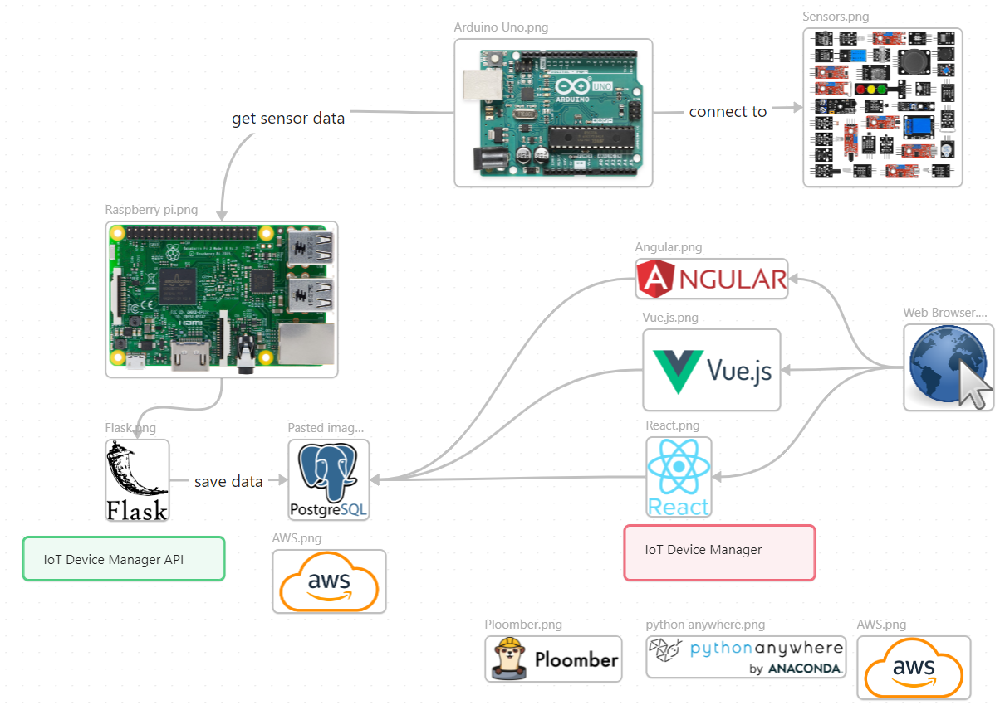

# IoT Device Manager API

This project is a Flask-based IoT device manager application that allows users to manage homes, rooms, sensors, schedules, statistics, and other related data. This file provides detailed instructions for running the project, an explanation of the folder structure, and a description of each endpoint, including examples of how to test the CRUD functionalities.

In the diagram below is shown the architecture of the final IoT project.



## Getting Started

### Prerequisites

- Python 3.8+
- pip (Python package installer)
- Virtual environment (optional but recommended)

### Installation

1. Clone the repository:
   ```bash
   git clone <repository_url>
   ```

2. Navigate to the project directory:
   ```bash
   cd flask_iot_device_manager
   ```

3. Create a virtual environment:
   ```bash
   python3 -m venv venv
   ```

4. Activate the virtual environment:
   - On Linux/macOS:
     ```bash
     source venv/bin/activate
     ```
   - On Windows:
     ```bash
     venv\Scripts\activate
     ```

5. Install the required dependencies:
   ```bash
   pip install -r requirements.txt
   ```

6. Run the application:
   ```bash
   flask run
   ```

The application will start running at `http://127.0.0.1:5000/`.

## Folder Structure

```
flask_iot_device_manager/
|-- app/
|   |-- __init__.py
|   |-- models/
|   |-- resources/
|   |-- schemas/
|   |-- services/
|   |-- tests/
|   |-- utils/
|-- app.py
|-- config.py
|-- db.py
|-- requirements.txt
```

- **app/**: Contains the main application code.
  - **models/**: Contains the database models, representing entities such as homes, rooms, sensors, and sensor data.
  - **routes/**: Defines the routes/endpoints for handling requests related to homes, rooms, sensors, etc.
  - **schemas/**: Defines request and response validation schemas using tools like Marshmallow.
  - **utils/**: Contains utility functions and modules such as the database setup.
- **config.py**: Configuration settings for the application.
- **requirements.txt**: Lists the dependencies required to run the project.
- **run.py**: The entry point to start the application.

- **app/**: Contains the main application code.

- **models/**: Contains the database models, representing entities such as homes, rooms, sensors, and sensor data.

- **resources/**: Contains the resource controllers for handling API requests.

- **schemas/**: Defines request and response validation schemas using tools like Marshmallow.

- **services/**: Contains the business logic for managing homes, rooms, sensors, etc.

- **tests/**: Contains unit and integration tests for the application.

- **utils/**: Contains utility functions and modules such as the database setup.

- **config.py**: Configuration settings for the application.

- **requirements.txt**: Lists the dependencies required to run the project.

- **app.py**: Main application entry point.

- **db.py**: Database initialization and connection.


## API Endpoints

### Register
- **POST** `/register`
  - **Description**: Register a new user.
  - **Example**:
    ```json
    {
    "username": "username",
    "password": "password1234",
    "first_name": "First Name",
    "last_name": "Last Name",
    "email": "username1@gmail.bg",
    "role": "user"
    }
    ```

### Login
- **POST** `/login`
  - **Description**: Login a user.
  - **Example**:
    ```json
    {
    "email": "username1@gmail.bg",
    "password": "password1234" 
    }
    ```
    or
  
    ```json
    {
    "username": "username",
    "password": "password1234" 
    }
    ```

### Homes
- **POST** `/homes`
  - **Description**: Create a new home.
  - **Example**:
    ```json
    {
      "address": "123 Main St",
      "city": "Metropolis",
      "state": "NY",
      "zip_code": "12345"
    }
    ```
- **GET** `/homes`
  - **Description**: Get a list of all homes.
- **GET** `/homes/<home_id>`
  - **Description**: Get details of a specific home.
- **PUT** `/homes/<home_id>`
  - **Description**: Update a home.
  - **Example**:
    ```json
    {
      "address": "456 Main St",
      "city": "Metropolis",
      "state": "NY",
      "zip_code": "54321"
    }
    ```
- **DELETE** `/homes/<home_id>`
  - **Description**: Delete a home.

### Rooms
- **POST** `/rooms`
  - **Description**: Create a new room.
  - **Example**:
    ```json
    {
      "name": "Living Room",
      "description": "Main family room",
      "home_id": 1
    }
    ```
- **GET** `/rooms`
  - **Description**: Get a list of all rooms.
- **GET** `/rooms/<room_id>`
  - **Description**: Get details of a specific room.
- **PUT** `/rooms/<room_id>`
  - **Description**: Update a room.
  - **Example**:
    ```json
    {
      "name": "Updated Living Room",
      "description": "Main family room with new furniture",
      "home_id": 1
    }
    ```
- **DELETE** `/rooms/<room_id>`
  - **Description**: Delete a room.

### Sensors
- **POST** `/sensors`
  - **Description**: Create a new sensor.
  - **Example**:
    ```json
     {
      "name": "Temperature",
      "sensor_type": "Sensor for measurement of temperature",
      "producer": "Unknown",
      "interface": "Serial Port",
      "room_id": 1
     }
    ```
- **GET** `/sensors`
  - **Description**: Get a list of all sensors.
- **GET** `/sensors/<sensor_id>`
  - **Description**: Get details of a specific sensor.
- **PUT** `/sensors/<sensor_id>`
  - **Description**: Get a sensor.
  - **Example**:
    ```json
    {
      "name": "Temperature1",
      "sensor_type": "Sensor1 for measurement of temperature",
      "producer": "Unknown1",
      "interface": "I2C",
      "room_id": 1
    }
    ```
- **DELETE** `/sensors/<sensor_id>`
  - **Description**: Delete a sensor.

### Sensor Data
- **POST** `/sensor_data`
  - **Description**: Create a new sensor data entry.
  - **Example**:
    ```json
    {
      "sensor_id": 1,
      "value": 22.5
    }
    ```
- **GET** `/sensor_data`
  - **Description**: Get all sensor data.
- **GET** `/sensor_data/<sensor_data_id>`
  - **Description**: Get details of a specific sensor data entry.
- **PUT** `/sensor_data/<sensor_data_id>`
  - **Description**: Update a sensor data entry.
  - **Example**:
    ```json
    {
      "value": 23.0
    }
    ```
- **DELETE** `/sensor_data/<sensor_data_id>`
  - **Description**: Delete a sensor data entry.

### Schedules
- **POST** `/schedules`
  - **Description**: Create a new schedule.
  - **Example**:
    ```json
    {
      "name": "Morning Routine",
      "sensor_id": 1,
      "start_time": "2024-11-04T08:00:00",
      "end_time": "2024-11-07T20:00:00",
      "action": "Activate"
    }
    ```
- **GET** `/schedules`
  - **Description**: Get all schedules.
- **GET** `/schedules/<schedule_id>`
  - **Description**: Get details of a specific schedule.
- **PUT** `/schedules/<schedule_id>`
  - **Description**: Update a schedule.
  - **Example**:
    ```json
    {
      "name": "Morning Routine",
      "sensor_id": 1,
      "start_time": "2024-11-04T08:00:00",
      "end_time": "2024-11-07T20:00:00",
      "action": "Deactivate"
    }
    ```
- **DELETE** `/schedules/<schedule_id>`
  - **Description**: Delete a schedule.

### Statistics
- **POST** `/statistics`
  - **Description**: Create a new statistic.
  - **Example**:
    ```json
    {
      "sensor_id": 1,
      "average_value": 30.0,
      "min_value": 10.0,
      "max_value": 50.0
    }
    ```
- **GET** `/statistics`
  - **Description**: Get all statistics.
- **GET** `/statistics/<statistic_id>`
  - **Description**: Get details of a specific statistic.
- **PUT** `/statistics/<statistic_id>`
  - **Description**: Update a statistic.
  - **Example**:
    ```json
    {
      "sensor_id": 1,
      "average_value": 33.0,
      "min_value": 14.0,
      "max_value": 53.0
    }
    ```
- **DELETE** `/statistics/<statistic_id>`
  - **Description**: Delete a statistic.

### User Authentication
- **POST** `/login`
  - **Description**: Login a user.

## Testing the Endpoints

You can test the endpoints using tools like [Postman](https://www.postman.com/) or `curl` commands.

### Example `curl` Command to Create a Room
```bash
curl -X POST http://127.0.0.1:5000/rooms -H "Content-Type: application/json" -d '{
  "name": "Kitchen",
  "description": "Cooking area",
  "home_id": 1
}'
```

### Example `curl` Command to Get All Homes
```bash
curl -X GET http://127.0.0.1:5000/homes
```

### Example `curl` Command to Update a Sensor
```bash
curl -X PUT http://127.0.0.1:5000/sensors/1 -H "Content-Type: application/json" -d '{
     "name": "Temp",
    "sensor_type": "Temperature",
    "producer": "Unknown",
    "interface": "IC2",
    "room_id": 1
}'
```

### Example `curl` Command to Delete a Schedule
```bash
curl -X DELETE http://127.0.0.1:5000/schedules/1
```

### Example `curl` Command to Create a Schedule
```bash
curl -X POST http://127.0.0.1:5000/schedules -H "Content-Type: application/json" -d '{
    "name": "Morning Routine",
    "sensor_id": 1,
    "start_time": "2024-11-04T08:00:00",
    "end_time": "2024-11-07T20:00:00",
    "action": "Activate"
}'
```

### Example `curl` Command to Create a Statistic
```bash
curl -X POST http://127.0.0.1:5000/statistics -H "Content-Type: application/json" -d '{
    "sensor_id": 1,
    "average_value": 30.0,
    "min_value": 10.0,
    "max_value": 50.0
}'
```


